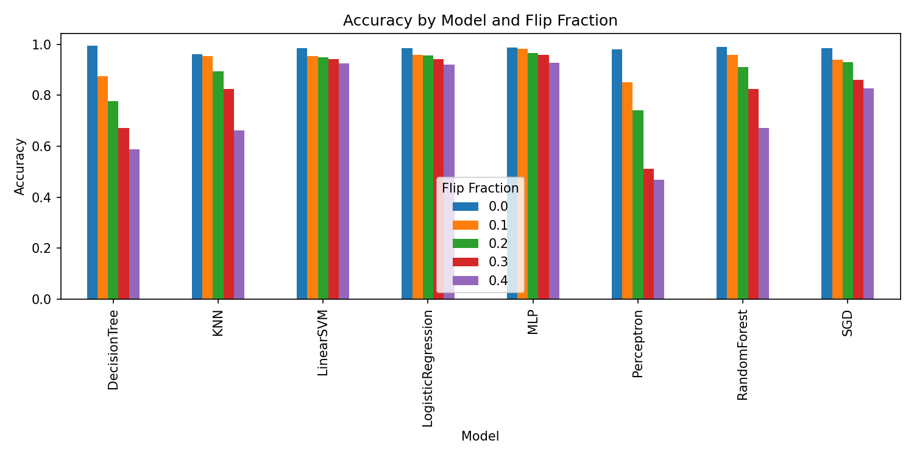
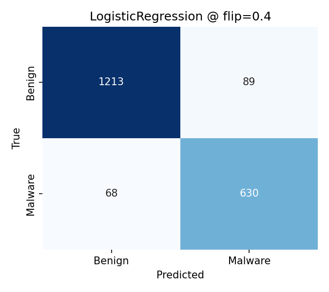
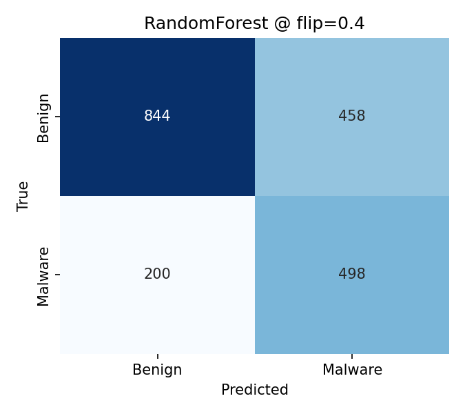
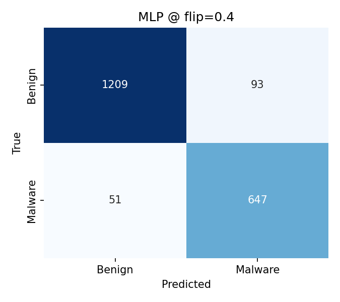

## Title slide
Label‑Flip Poisoning Attack on ML‑based Malware Detectors

- Your Name, Affiliation
- Based on: Aryal et al., “Analysis of Label‑Flip Poisoning Attack on Machine Learning Based Malware Detector”
- Paper: http://arxiv.org/pdf/2301.01044
- Dataset: https://www.kaggle.com/competitions/malware-detection/data

---

## Introduction
- Why ML for malware detection:
  - Scale: billions of samples → manual triage infeasible
  - Generalization: beyond signatures and static rules
  - Adaptivity: retrain as threats evolve
- Feature sources:
  - Static (PE headers, imports, byte/strings)
  - Dynamic (behavior/API traces, network I/O)
  - Hybrid/metadata (reputation, sandbox outcomes)
- Models in practice/research:
  - Linear/logistic, SVMs
  - Trees/ensembles (Random Forest, boosting)
  - k‑NN, MLPs, deeper architectures

---

## Problem definition
- Objective (paper): measure how training‑time label flips impact malware detector performance across model families
- Threat model: flip y for a fraction of training samples (10–20%); clean test set
- Why this paper:
  - Realistic: weak/automated labeling pipelines introduce noise
  - Comparative: 8 classic models → family‑specific brittleness
  - Security: recall degradation = missed malware (critical risk)
- Why evaluate across models:
  - Linear boundaries shift under noise; trees often more resilient; MLPs mixed

---

## Methodology (paper)
- Dataset: VT/VirusShare‑style binary labels (paper’s corpus)
- Models (8): SGD, RandomForest, LogisticRegression, KNN, LinearSVM, DecisionTree, Perceptron, MLP
- Protocol:
  - Stratified train/test; identical split for clean vs. poisoned
  - Poisoning: random label flips at 10% and 20% of training labels
  - Metrics: Accuracy, Precision, Recall; confusion analyses

---

## Methodology (our implementation)
- Data: `ML-case-study/Kaggle-data.csv` (label: `legitimate`)
- Split: stratified 80/20, seed=42; sample ≈10k rows for runtime
- Preprocessing: median impute; scaling for linear/NN/KNN; trees use imputation only
- Models: same 8; unified pipelines
- Command:
```bash
python ML-case-study/run_experiments.py \
  --input-csv ML-case-study/Kaggle-data.csv \
  --label-col legitimate \
  --sample-size 10000 \
  --test-size 0.2 \
  --flip-fracs 0.0 0.1 0.2 0.3 0.4 \
  --seed 42 \
  --output-dir ML-case-study/outputs
```

---

## Results and Discussion (paper findings)
10% flip — percent change vs. clean (paper):

| Model               | Acc Δ   | Rec Δ    | F1 Δ    |
|---------------------|---------|----------|---------|
| SGD                 | −0.8%   | −22.1%   | −6.6%   |
| Decision Tree       | −13.0%  | −26.5%   | −19.8%  |
| Random Forest       | −4.2%   | +11.3%   | −0.4%   |
| Logistic Regression | −9.8%   | −14.6%   | −13.4%  |
| KNN                 | −11.1%  | −15.7%   | −14.7%  |
| Linear SVM          | −27.5%  | −63.7%   | −52.8%  |
| Perceptron          | −46.7%  | −64.7%   | (n/a)   |
| MLP                 | +15.8%  | −8.9%    | +15.5%  |

Source: Aryal et al. — see paper for full figures

---

## Results and Discussion (paper relevance)
- Trends supported by paper visuals:
  - Recall suffers most → more false negatives (missed malware)
  - Linear/SVM degrade sharply; tree ensembles more resilient at low flip
  - Patterns persist across settings/seeds
- Insert paper screenshots (tables/plots) here if permitted
- Reference: [Aryal et al. PDF](http://arxiv.org/pdf/2301.01044)

---

## Results and Discussion (our local results)
Accuracy by model and flip fraction:



Confusion matrices @ flip = 0.4:

  

- Alignment: recall drops; linear models brittle; RF relatively robust
- Differences vs paper: dataset/feature domain, sample size/runtime, preprocessing/regularization, single split/seed

---

## Conclusion and future work (paper conclusion)
- Label‑flip poisoning degrades malware detectors; impact varies by model family
- Linear/SVM degrade most; tree ensembles relatively resilient at lower flip; MLP mixed
- Takeaway: label integrity and data‑quality gates are essential in production pipelines

---

## Conclusion and future work (defenses)
1. Data provenance & trusted labeling — [Datasheets for Datasets (Gebru et al.)](https://arxiv.org/abs/1803.09010)
2. Label sanitization / outlier detection — [Confident Learning / Cleanlab (Northcutt et al.)](https://arxiv.org/abs/1911.00068)
3. Influence‑based auditing — [Influence Functions (Koh & Liang)](https://arxiv.org/abs/1703.04730)
4. Robust learning objectives — [Generalized Cross‑Entropy (Zhang & Sabuncu)](https://arxiv.org/abs/1805.07836)
5. Adversarial / poison‑aware training — [Certified Defenses for Data Poisoning (Steinhardt et al.)](https://arxiv.org/abs/1706.03691)
6. Ensemble & cross‑validation across sources — [Co‑Teaching (Han et al.)](https://arxiv.org/abs/1804.06872)
7. Continuous monitoring & rollback — [Hidden Technical Debt in ML (Sculley et al.)](https://arxiv.org/abs/1609.03731)
